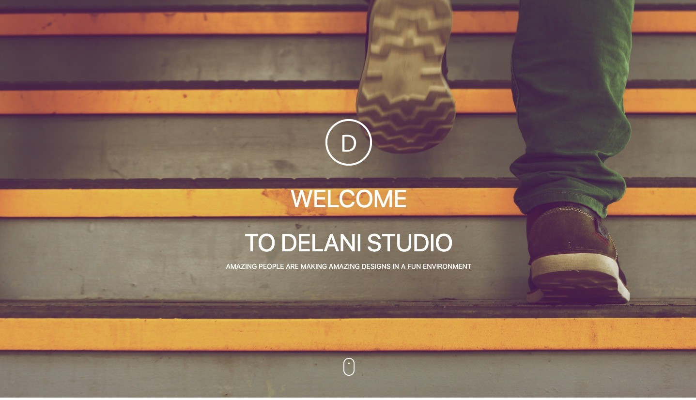

 # DELANI STUDIO

#### This is a Portfolio landing-page  website.
#### By **_Ian Njenga_**
-------------------------
## Description
The website is a landing page which has several features. It has an about section where it tells who we are then, _what we do_ section which on clicking displays text. Our _portfolio_ has been displayed there and on hovering you get the name of the project done. Finally a contact us section which tracks the messages sent us. 
## Setup/Installation Requirements
There is no special installation needed. The website runs on all browsers. You can run it on chrome browser.

## Technologies Used
I used the following technologies;
- Html
- Css
- Bootstrap
- Javascript
- Jquery
## Support and contact details
You can reach me through ian.wanarua@student.moringaschool.com
### [Live demo](https://ianwanarua.github.io/Delani-studio/)
### License
This project is under this [MIT](LICENSE)  
Copyright (c) 2021 **Delani_studio**